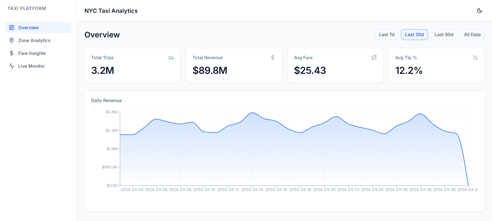
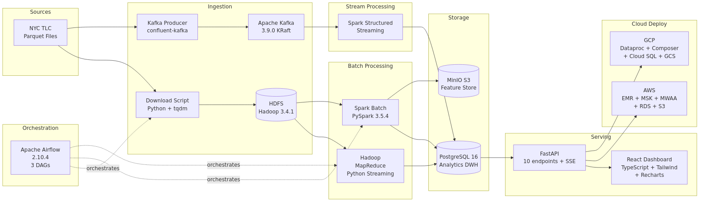

# NYC Taxi Analytics Platform

[](https://github.com/hassanzaibhay/nyc-taxi-analytics-platform/actions)




End-to-end big data analytics platform processing NYC TLC taxi trip records through Hadoop, Spark, Kafka, Airflow, PostgreSQL, FastAPI, and a React dashboard — all containerized with Docker Compose and deployable to AWS or GCP via Terraform.

## Architecture



Source: [`docs/architecture.mermaid`](docs/architecture.mermaid) — regenerate the PNG with `docker run --rm -v "$(pwd)/docs:/data" minlag/mermaid-cli -i /data/architecture.mermaid -o /data/architecture-diagram.png -w 1600 -H 900 --backgroundColor white`.

## Quick Start

**Prerequisites:** Docker Desktop, Git, GNU Make (Git Bash on Windows).

```bash
git clone https://github.com/hassanzaibhay/nyc-taxi-analytics-platform.git
cd nyc-taxi-analytics-platform
cp .env.example .env
# Edit .env and set POSTGRES_PASSWORD, MINIO_ROOT_PASSWORD, AIRFLOW__CORE__FERNET_KEY
make all
```

`make all` will: build images → start the cluster → download sample TLC data → run the batch pipeline → start the dashboard.

## Web UIs

| Service | URL | Description |
|---|---|---|
| Dashboard | http://localhost:3000 | React analytics frontend |
| FastAPI Docs | http://localhost:8000/docs | OpenAPI / Swagger UI |
| Airflow | http://localhost:8081 | DAG orchestration (admin/admin) |
| Hadoop NameNode | http://localhost:9870 | HDFS browser |
| YARN | http://localhost:8088 | Resource manager |
| Spark Master | http://localhost:8080 | Spark cluster UI |
| MinIO | http://localhost:9001 | S3-compatible object store |

## Project Structure

```
nyc-taxi-analytics-platform/
├── docker/              # Dockerfiles, configs, init scripts
├── src/
│   ├── hadoop/          # MapReduce mappers/reducers (Python streaming)
│   ├── spark/           # Batch + streaming PySpark jobs
│   ├── kafka/           # Producer + schemas
│   ├── ingestion/       # Download, validate, upload to HDFS
│   ├── api/             # FastAPI REST backend
│   └── frontend/        # React + Vite + Tailwind + Recharts
├── airflow/dags/        # Orchestration DAGs
├── infra/{aws,gcp}/     # Terraform modules
├── scripts/             # Job submission helpers
├── tests/               # Pytest suite
├── docs/                # Architecture, design decisions, data dictionary
├── docker-compose.yml
├── Makefile
└── README.md
```

## Pipeline Overview

1. **Ingestion** — `download_tlc_data.py` pulls monthly Parquet files from the TLC CloudFront mirror, `validate_data.py` enforces schema and quality, `upload_to_hdfs.py` moves them into HDFS.
2. **Batch processing** — Hadoop MapReduce computes zone aggregates; Spark batch jobs build hourly demand, daily revenue, and fare-prediction features, writing results to PostgreSQL.
3. **Streaming** — A Kafka producer replays trips into the `nyc-taxi.trips.raw` topic; Spark Structured Streaming computes 15-minute sliding windows and writes them to `realtime.zone_demand_live`.
4. **Orchestration** — Airflow schedules ingestion, batch analytics, and quality checks.
5. **Serving** — FastAPI exposes typed endpoints over PostgreSQL; the React dashboard renders KPIs, charts, and a live SSE-driven monitor.

## Cloud Deployment

```bash
# AWS (EMR + S3 + MSK + MWAA + RDS)
make tf-plan-aws
make tf-apply-aws

# GCP (Dataproc + GCS + Pub/Sub + Composer + Cloud SQL)
make tf-plan-gcp
make tf-apply-gcp
```

See `docs/cloud-deployment-guide.md` for full instructions, prerequisites, and a cost-estimation table.

## Technology Stack

| Layer | Technology |
|---|---|
| Storage | HDFS, MinIO (S3), PostgreSQL 16 |
| Batch | Hadoop 3.4.1, Spark 3.5.4 |
| Streaming | Kafka 3.9.0 (KRaft), Spark Structured Streaming |
| Orchestration | Airflow 2.10.4 |
| API | FastAPI, async SQLAlchemy, asyncpg |
| Frontend | React 18, Vite, TypeScript, Tailwind, Recharts |
| Infrastructure | Docker Compose, Terraform |

## Data Source

NYC Taxi & Limousine Commission (TLC) yellow taxi trip records, distributed monthly as Parquet files at https://www.nyc.gov/site/tlc/about/tlc-trip-record-data.page. The dataset is government-published, has a stable schema, and contains hundreds of millions of rows per year — making it an ideal benchmark for big-data engineering.

## Performance

Measured on Docker Desktop, Windows 11, 16 GB RAM, 8-core CPU, local SSD. Numbers are approximate and will vary by machine.

| Pipeline Stage | Data Size | Duration | Throughput |
|---|---|---|---|
| Data Download (TLC) | ~160 MB (3 months yellow) | ~2 min | — |
| HDFS Ingestion | ~160 MB | ~30 s | — |
| Hadoop MapReduce (zone agg) | ~3.2M trips | ~2 min | — |
| Spark Batch — trip_analytics | ~3.2M trips | ~45 s | ~70k rows/s |
| Spark Batch — revenue_aggregation | ~3.2M trips | ~30 s | ~100k rows/s |
| Spark Batch — fare_prediction_features | ~3.2M trips | ~40 s | ~80k rows/s |
| Kafka Producer | ~3.2M events | depends on `KAFKA_PRODUCER_DELAY_MS` | ~8k events/s (delay=0) |
| Spark Structured Streaming | continuous | — | ~500 rows/micro-batch (15s window) |

All batch jobs log `Job completed in Xs — N rows written` via the `time.time()` wrapper in `main()`. The Kafka producer logs a final `events/sec` line on shutdown.

## Contributing

1. Fork and create a feature branch (`feat/<name>`).
2. Run `make lint` and `make test` before opening a PR.
3. Follow Conventional Commits for messages.

## License

MIT — see [LICENSE](LICENSE).

---

Built by **Hassan Zaib Hayat** — Part of a 5-project Data Engineering portfolio series.
