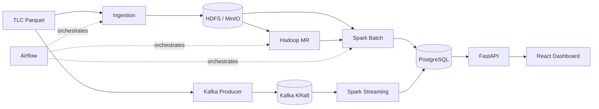

# Architecture

## Overview

The NYC Taxi Analytics Platform is a layered, container-first big data system. Each layer is independently deployable, observable, and replaceable.

## Layers

**Storage**
- HDFS for raw and processed Parquet at scale.
- MinIO as a local S3-compatible object store (mirrors AWS S3 / GCS).
- PostgreSQL as the analytics warehouse, with separate schemas: `raw`, `analytics`, `realtime`.

**Compute**
- Hadoop MapReduce (Python Streaming) for zone- and fare-level aggregates.
- Spark batch jobs for hourly demand, daily revenue, and fare-prediction features.
- Spark Structured Streaming for real-time per-zone demand windows.

**Orchestration**
- Airflow runs three DAGs: monthly ingestion, daily batch analytics, and post-batch quality checks.

**Serving**
- FastAPI exposes typed REST endpoints with async PostgreSQL access.
- React dashboard consumes the API via TanStack Query and an SSE stream for live data.

## Data Flow

1. **Raw → Staged**: TLC parquet downloaded, validated, and uploaded to HDFS partitioned by `year/month`.
2. **Staged → Processed**: Hadoop and Spark jobs compute aggregates, writing to PostgreSQL `analytics.*` tables.
3. **Processed → Served**: FastAPI reads from `analytics.*` and `realtime.*` and serves to the dashboard.
4. **Real-time path**: Kafka producer → Kafka topic → Spark Streaming → `realtime.zone_demand_live` → SSE → dashboard.

## Network

A single Docker bridge network (`nyc-taxi-net`) wires every service. Inter-service traffic uses container hostnames; only intentional ports are exposed to the host.
